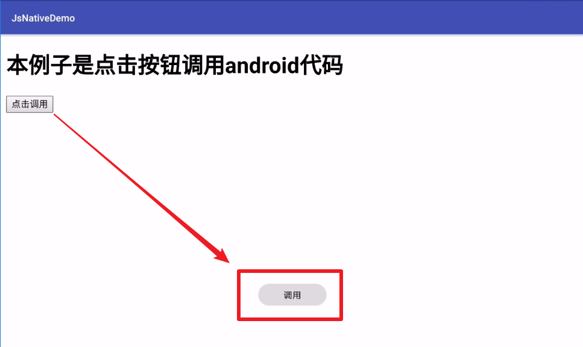

# JSWidthAndroidNative
JS调用Android（Java）接口

项目源码基于：[weifengzz/JSWidthAndroidNative: android与js混编 ](https://github.com/weifengzz/JSWidthAndroidNative)
项目主要使用了本地HTML调用Android代码进行弹Toast，也可以加载网页调用的：主要服务
器代码在JsNativeNode文件夹中（这里使用Node.js编写）

## 截图

## 教程
* [Android 中JS 调用java 代码 - 简书 ](https://www.jianshu.com/p/4eb93bf880a9)

